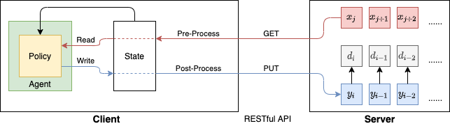

# Get started

This tutorial will go through the basic structure of SimulEval and a small example of agent implementation. SimulEval is toolkit for simultaneous translation evaluation. A simultaneous translation system is usually evaluated with two aspects, quality and latency. The latency refers to the simultaneous ability, which is how much partial source information is needed to start the translation process.

In order to measure the latency, SimulEval uses a server-client structure to simulate the simultaneous translation setting, as show in the following figure, where `x` is the input sequence, `y` is the predicted sequence and `d` is the corresponding delays.
.

The server has two functions.
First, it sends new input (words for text and audio samples for speech), to client, upon the request from the simultaneous translation system.
We usually call this a **READ** action.
Second, if the simultaneous translation system decides to generate a new prediction, or usually known as **WRITE** action, the server will receive the output from the system, and records the corresponding delay.
The output sequence can be used for quality evaluation and the delay sequence can be used for latency evaluation.

The client, on the other hand, provide a running environment for the system to be evaluated.
There is two parts in the client, states and agent.
States store the run time information, such as current input, output etc,
that can be reached by the system at anytime.
Agent is where users implement their simultaneous translation systems.
It should have these functions:
- Predict **READ** or **WRITE** action given current context.
- If the action is **WRITE**, generate a prediction.
- (Optional) Pre-process and post-processing.

During the evaluation, SimulEval will handle the decoding process and evaluation as long as a user defined agent is provided.

Following is an example implementation. It runs a wait-k policy [(Ma et al, 2019)](https://www.aclweb.org/anthology/P19-1289.pdf). When the policy decides to write, it predict a dummy token (`word_i`, where `i` is the index of the target word). The decoding completes when the system predicts `DEFAULT_EOS`.
Notice that the user has to define at least two functions as we mentioned before: `policy` which returns the action and `predict` which returns the prediction.
Both functions take `states` as an input argument, which contains the contextual information.
```
from simuleval.agents import TextAgent
from simuleval import READ_ACTION, WRITE_ACTION, DEFAULT_EOS


class DummyWaitkTextAgent(TextAgent):

    data_type = "text"

    def __init__(self, args):
        super().__init__(args)
        self.waitk = args.waitk
        # Initialize your agent here,
		# for example load model, vocab, etc

    @staticmethod
    def add_args(parser):
        # Add additional command line arguments here
        parser.add_argument("--waitk", type=int, default=3)

    def policy(self, states):
        # Make decision here
		# A waitk policy
        if (
			len(states.source) - len(states.target) < self.waitk
			and not states.finish_read()
		):
            return READ_ACTION
        else:
            return WRITE_ACTION

    def predict(self, states):
        # predict token here
        if states.finish_read():
            if states.target.length() == states.source.length():
				# When DEFAULT_EOS is predicted, the decoding process finishes.
                return DEFAULT_EOS

        return f"word_{len(states.target)}"
```

Once we have the agent, we can run the evaluation.
In this example the file contains the agent is [`examples/dummy/dummy_waitk_text_agent.py`](../examples/dummy/dummy_waitk_text_agent.py).
We can run the following command to start the SimulEval to evaluate a wait-5 dummy text translation system. `--source` and `--target` are the source and reference (the data we use in this example can be found [here](../examples/data)).
```
simuleval \
	--agent examples/dummy/dummy_waitk_text_agent.py \
	--waitk 5 \
	--source examples/data/src.txt \
	--target examples/data/tgt.txt
```

At the end of the evaluation, the results will be printed on the screen, like following.
```
{
    "Quality": {
        "BLEU": 0.06934086086827945
    },
    "Latency": {
        "AL": 5.0,
        "AP": 0.7560754895210267,
        "DAL": 5.0
    }
}
```

Furthermore, if you would like to evaluate the system with time stamps of source input from a upstream system (e.g. a streaming ASR system).
```
simuleval \
	--agent examples/dummy/dummy_waitk_text_agent.py \
	--waitk 5 \
	--source examples/data/src.txt \
	--target examples/data/tgt.txt \
	--source-timestamps examples/data/src_time.txt
```
Where `--source-timestamps` is a file each line of which contains the time stamps for words for the corresponding source input sentence.
The results will come with corespoding latency in time.
```
{
    "Quality": {
        "BLEU": 0.06934086086827945
    },
    "Latency": {
        "AL": 5.0,
        "AL (Time in ms)": 1656.442724609375,
        "AP": 0.7560754895210267,
        "AP (Time in ms)": 0.7404875814914703,
        "DAL": 5.0,
        "DAL (Time in ms)": 2462.1722412109375
    }
}
```

Right now we support BLEU (Papineni et al., 2002; [Post, 2018](https://www.aclweb.org/anthology/W18-6319/)) for quality evaluation; [Average Lagging (Ma et al., 2019)](https://www.aclweb.org/anthology/P19-1289.pdf), [Differentiable Average Lagging (Cherry and Foster, 2019)](https://arxiv.org/abs/1906.00048) and [Average Proportion (Cho and Esipova, 2016)](https://arxiv.org/abs/1606.02012) for latency evaluation.

This tutorial provides a minimal usage of SimulEval.
More details can be found here.
- [Server-Client interface](./server_client.md).
- [Evaluation](./evaluation.md).
- [RESTful API](./restful_api.md).
- [T2T systems with source time stamps](./timestamps.md).
- [Simultaneous Speech Translation with fairseq](https://github.com/pytorch/fairseq/blob/master/examples/speech_to_text/docs/simulst_mustc_example.md)
